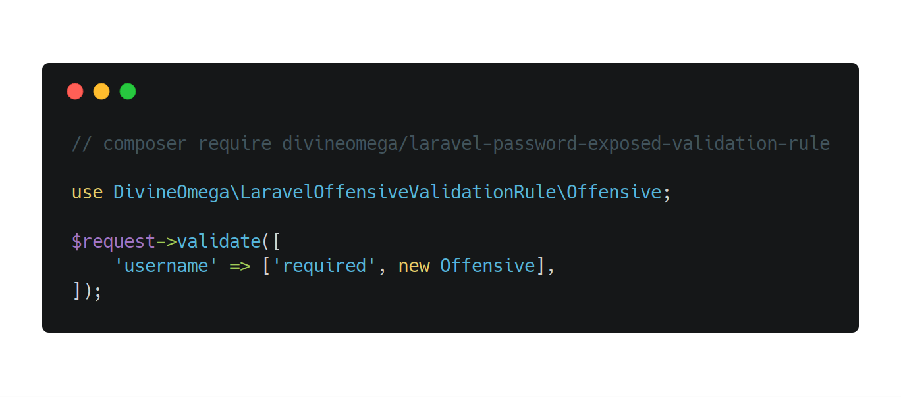

# 🤬🤭 Laravel Offensive Validation Rule

This package provides a Laravel validation rule that checks if a string is offensive. It can be useful
to check user supplied data that may be publicly displayed, such as usernames or comments. 

<p align="center"></p>

<p align="center">
    <a href="https://travis-ci.org/DivineOmega/laravel-offensive-validation-rule">
        
    </a>
    <a href='https://coveralls.io/github/DivineOmega/laravel-offensive-validation-rule?branch=master'>
        
    </a>
    <a href="https://styleci.io/repos/132460621">
        
    </a>
</p>

## Installation

To install, just run the following Composer command.

```
composer require divineomega/laravel-password-exposed-validation-rule
```

Please note that this package requires Laravel 5.1 or above.

## Usage

The following code snippet shows an example of how to use the offensive validation rule.

```php
use DivineOmega\LaravelOffensiveValidationRule\Offensive;

$request->validate([
    'username' => ['required', new Offensive],
]);
```
